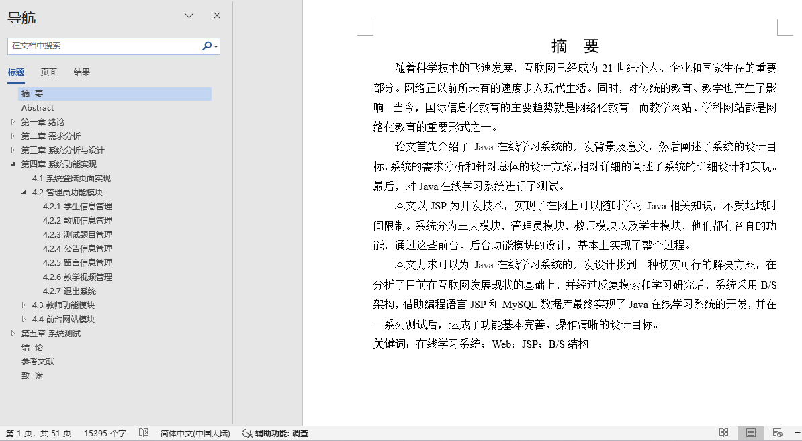
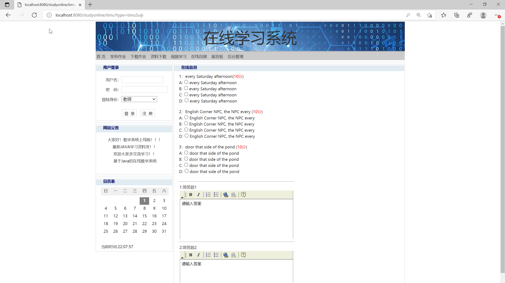
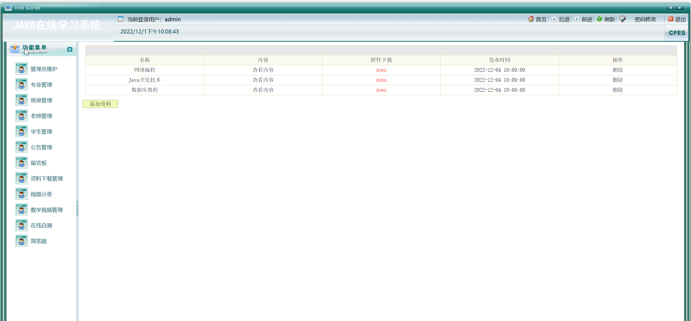
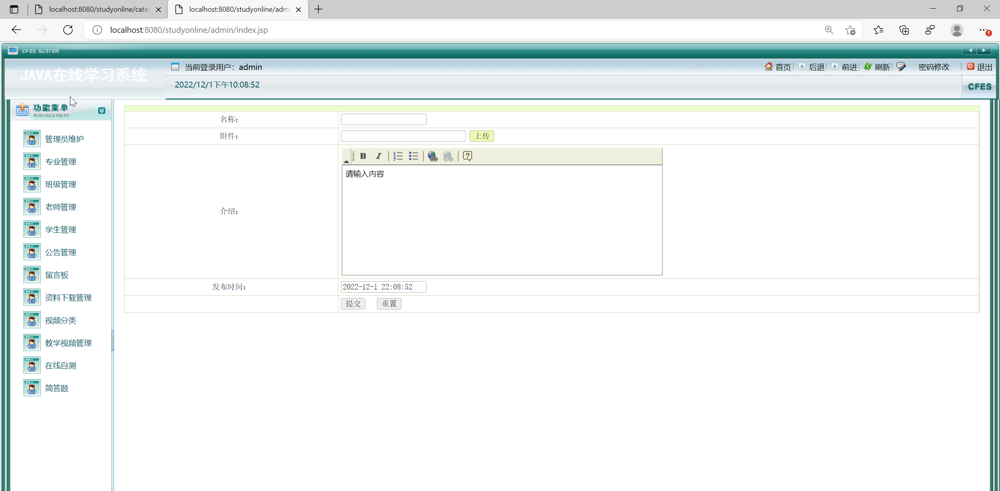
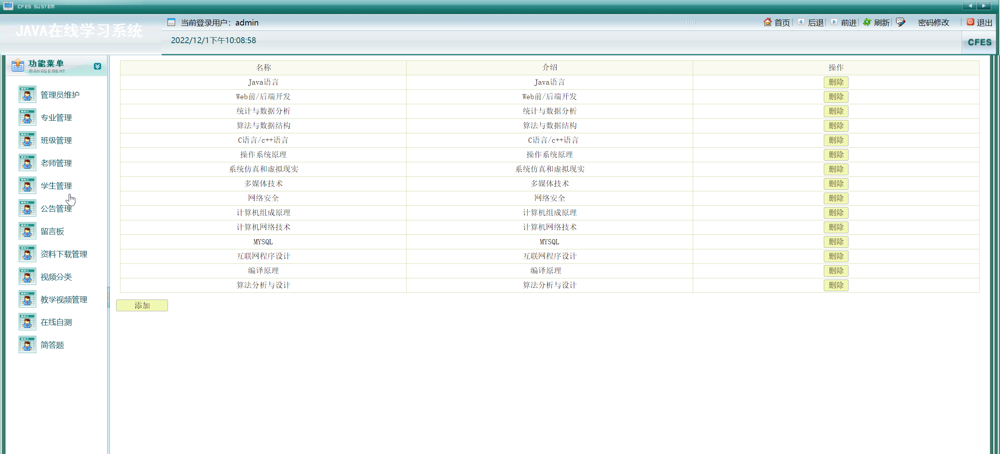
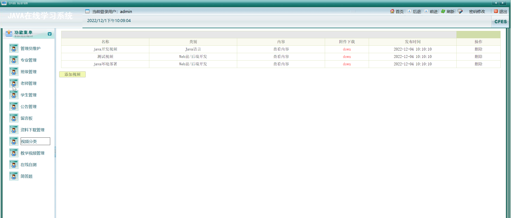
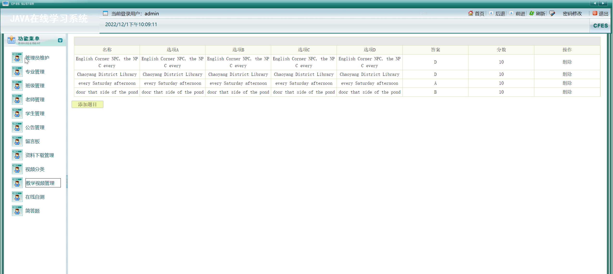
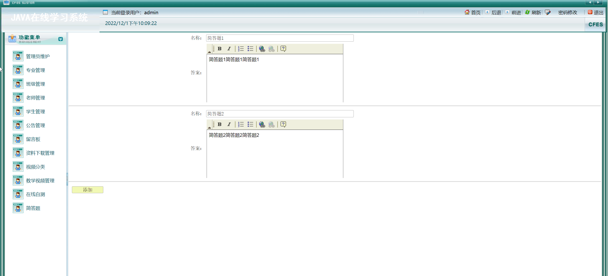

## 基于JSP+Servlet实现的在线学习系统(程序+报告)

- <b>完整代码获取地址：从戎源码网 ([https://armycodes.com/](https://armycodes.com/))</b>
- <b>技术探讨、资料分享，请加QQ群：692619798</b> 
- <b>作者微信：19941326836  QQ：952045282</b> 
- <b>承接计算机毕业设计、Java毕业设计、Python毕业设计、深度学习、机器学习</b>
- <b>选题+开题报告+任务书+程序定制+安装调试+论文+答辩ppt 一条龙服务</b>
- <b>所有选题地址 ([https://github.com/YuLin-Coder/AllProjectCatalog](https://github.com/YuLin-Coder/AllProjectCatalog)) </b>

## 项目介绍
基于JSP+Servlet实现的在线学习系统，系统采用B/S结构，使用JAVA开发语言，以MySQL作为后台数据库。
系统共包含三种角色：管理员、教师、学生，各角色的具体功能如下：
1.管理员
专业管理、班级管理、教师管理、学生管理、公告管理、在线自测管理、留言板管理、资料下载管理、教学视频管理等功能。
2.教师
首页、教师登陆、发布作业、下载作业、查看公告信息、教师留言、资料下载、查看教学视频、在线自测等功能。
3.学生
首页、学生登陆、下载作业、查看教师视频、学生留言、在线自测等功能。

## 项目技术
- 编程语言：Java
- 数据库：MySQL
- 前端技术：JSP、JavaScript、bootstrap、JQuery
- 后端技术：Servlet、JDBC

## 运行环境
- JDK版本：JDK1.8及以上
- 开发工具：IDEA、Ecplise、Myecplise都可以
- 数据库: MySQL5.7及以上

## 运行截图

